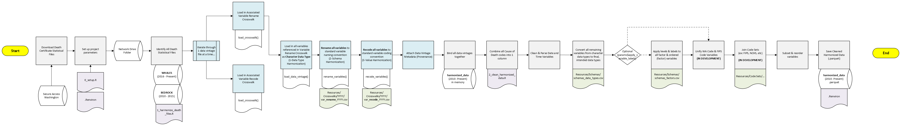

# Overview
WA LHJs are provided death certificate data by the WA DOH Center for Health Statistics (CHS) in the Secure Access Washington platform. This repository covers the preparation and use of person level microdata which can be used for in-depth population health analyses from 2010 to present.

## Author(s) & Contributor(s)
- [Tyler Bonnell](mailto:Tyler.Bonnell@co.snohomish.wa.us) (Snohomish County Health Department - Informatics & Data Management Epidemiologist)
- [Jacob Armitage](mailto:jacob.armitage@co.thurston.wa.us) (Thurston County Public Health & Social Services Deparmtent - Assessment & Evaluation Epidemiologist)
- [Neil Panlasigui](mailto:neilp@co.skagit.wa.us) (Skagit County Public Health - Epidemiologist)

## Motivation
WA DOH CHS provides two sets of death certificate data vintages which have distinct schemas and value-code sets, making it difficult to derive granular insights over extended time periods. This repository aims to address this problem by generating a data pipeline that integrates the various data vintages into a single harmonized data set.

| **Year(s)** | **Source**                                        | **Contact** | **Notes**                                                                                                                           |
| ----------- | ------------------------------------------------- | ----------- | ----------------------------------------------------------------------------------------------------------------------------------- |
| 1980-2015   | BEDROCK                                  | DOH         | Only 2010 to 2015 data vintages are available in Secure Access Washington                                                                                                                                    |
| 2016+       | [Washington Health and Life Events System (WHALES)](https://doh.wa.gov/licenses-permits-and-certificates/vital-records/whales) | DOH         | Bedrock --> WHALES migration means that BEDROCK data vintages must have variable names and coded values converted to align with WHALES schema. |

- **STAT** - This data contains nearly all of the demographic information about the decedent, dates, codes for causes of death, and other intent and mechanism information about the death.
- **GEO** - This data contains lattitude and longitude information that is then geocoded to blocks, school districts, zip codes, and other geographic identifiers.
- **NAMES** - This data contains full names, SSNs, and full address of the decedent.
- **LITERAL** - This data contains full text descriptions for causes of death.

Multiple versions of the data sets are sent throughout the year. There are preliminary and final versions of the data. Preliminary data will come in the form of quarterly (Q1, Q2, Q3, Q4) and then several less descriptive versions (Q5, Q6, P). Q5 and Q6 are typically not adding new rows but filling in or updating columns in already existing rows. P is usually the last preliminary and most complete file before the final file (F) is released.

# Data Processing Workflow

## Pre-Requisites
1. **All raw WA DOH CHS Death Certificate data files be downloaded from Secure Access Washington and placed in a single folder location**. Preferrably, this folder location will only store death data files, and not include any documentation-related files. 

## How to Run the Code
1. Download all WA DOH CHS Death Certificate Statistical Files from Secure Access Washington.
2. Run `Scripts/0_setup.R`. This script loads all packages and custom functions, defines workflow parameters, defines filepaths, and loads in code sets (ex: cemetery, coutnry, facility, fips, and more).
3. Run `Scripts/1_harmonize_death_files.R`. This script loads each data vintage, performs Data Type Harmonization (all variables as character data types), performs Schema Harmonization (all variables to standardized naming convention), and performs Value Harmonization (recodes data vintage variable values to a set of standardized code options). Lastly, it binds all data vintages together into a single, multiple year data set labelled `harmonized_data`..
7. Run `Scripts/2_clean_harmonized_data.R`. This unifies variables in `harmonized_data` (ex: some data vintage years only have `disposition_facility_codes`, some data vintage years only have `disposition_facility_names` --> align `disposition_facility` to a single varaible across all of the years), convert all variables to proper, finalized data types (ex: characters --> date, time, or factor variables), applies factor labels to all categorical values (optional) so values are easily understood, and performs joins to expand code sets (ex: cemetery, coutnry, facility, fips, and more).

### Workflow Diagram

## Workflow Inputs

| **Data** | **Location** | **Last Update** | **Notes** |
|----------|--------------|-----------------|-----------|
| Raw Death Statistical Files | **User Determined** in `.Renviron` file | 2026-03-02 | Users provide the filepath to folder containing all of your organization's raw death statistical files (downloaded from Secure Access Washington) |
| `rename_variables_YYYY.csv` | `Resources/Crosswalks/YYYY` | 3/26/2026 | **Crosswalks data vintage variable names** to the standardized variable naming convention for `harmonized_data` (these variables align with `janitor::clean_names()` as lower snake_case. `rename_variables_YYYY.csv` are an **annual** file (as there are year-over-year variations in variable naming conventions), and only include the subset of overall variables to be included in the `harmonized_data`. | 
| `all_rename_variables.csv` | `Resources/Crosswalks` | 3/26/2026 | Uses `Scripts/crosswalk_review.R` to combines all annual `rename_variables_YYYY.csv` files into 1 single file to enable quick, user review of variable renaming crosswalks across all data vintages. | 
| `recode_variables_YYYY.csv` | `Resources/Crosswalks/YYYY` | 3/26/2026 | **Crosswalks data vintage variable coded values** to the standardized variable coding convention for `harmonized_data`. `recode_variables_YYYY.csv` are an **annual** file (as there are year-over-year variations in coding conventions), and only include variable-code value pairs that deviate from the standardized coding convention (if variables-code value pairs don't require recoding they are not included). | 
| `all_recode_variables.csv` | `Resources/Crosswalks` | 3/26/2026 | Uses `Scripts/crosswalk_review.R` to combines all annual `code_variables_YYYY.csv` files into 1 single file to enable quick, user review of variable recoding crosswalks across all data vintages.| 
| `schema_data_types.csv` | `Resources/Schemas` | 3/26/2026 | Indicates the proper, finalized data types for all variables in `harmonized_data`. This is used to convert `harmonized_data` variables from character data type (used throughout the data pipeline) to intended data types for end use (such as dates, times, factors, and more). | 
| `schema_factors.csv` | `Resources/Schemas` | 3/26/2026 | This file provides all of the desired levels and labels for `harmonized_data`'s factor and ordered (factor) variables. | 

### Custom Functions (& Helper R Scripts)

Custom R functions were developed to streamline and increase the legibility of this data pipeline. Custom functions are stored under `Scripts/Custom_Functions/`.

**1_harmonize_death_files.R**
- `load_crosswalk()`: Loads the `rename_variables_YYYY.csv` or `recode_variables_YYYY.csv` for the given year.
- `load_data_vintage()`: Loads the specified Death Statistical Annual File. Performs under-the-hood operations including Data Type Harmonization (all variables as character data type), adding any missing variables (that are present in other data vintages) with all values as NA, and converting standard placeholders (i.e. "" or "NA" to `NA` values).
- `rename_variables()`: Performs Schema Harmonization (data vintage variable names --> standard variable naming convention for `harmonized_data`) using related `rename_variables_YYYY.csv` file. Remaining variables are organized with `state_file_number` first, then the remaining in alphabetical order.
- `recode_variables()`: Performs Value Harmonization (data vintage variable coding --> standard variable coding convention for `harmonized_data`) using related `recode_variables_YYYY.csv` file. Only variable-code value pairs that are not in the standard variable coding convention for `harmonized_data` are converted.

**2_clean_harmonized_data.R**
- `unify_variables()`: Takes versions of similar variables (ex: `disposition_facility_code` - `disposition_facility_name`, and `funeral_home_code` and `funeral_home_name`) that are slightly different across annual data vintages, and combines them into a singular, standardized variable in `harmonized_data`.
- `combine_code_columns()`: Takes the many code columns (ex: `record_axis_code_1` to `record_axis_code_20`) and combines them into a single code column as a concatenated string (to allow for easier data management).
- `clean_date_variables()`: Takes the numerous date variables (stored as the character data type) and converts them to date data types. This function excepts dates formatted in many ways (see the `orders` parameter), and dates with improper formatting or unrealistic values are converted automatically to `NA`.
- `clean_time_variables()`: Takes the numerous time variables (ex: time_of_death, time_of_death_hour, time_of_death_minute, time_of_injury, time_of_injury_hour, time_of_injury_minute) whose format and availability can vary year-to-year, and converts the values from character data type to time (lubridate hms) data type.
- `clean_data_types()`: Uses `schema_data_types.csv` to convert `harmonized_data` variables to their final proper data types. **Note:** This does not apply to `date` and `time` related variables as they are handled previously/exclusively in `clean_date_variables()` and `clean_time_variables()`. Includes an audit feature to see original vs converted data types for all variables.
- `apply_variable_labels()`: This functional is optional to use (as determined by `params$apply_variable_labels` in `0_setup.R`). It uses `schema_factors.csv` to apply proper levelling and labels to all factor and ordered (factor) variables indicated in `schema_data_types.csv`. It includes an audit feature to see applied levels and labels as well as any potentially unmatched values.

**investigate_missingness.R**
- This is an R script - not a custom R function!
- Once `harmonized_data` is generated after running `1_harmonize_death_files.R`, users can run this script to generate a heat map of variable completeness over time (by file year) to detect and investigate any potential data quality issues.

**crosswalk_review.R**
- This is an R script - not a custom R function!
- This R script should be run anytime any of the `rename_variables_YYYY.csv` or `recode_variables_YYYY.csv` are edited.
- This R script loads and combines all `rename_variables_YYYY.csv` and `recode_variables_YYYY.csv` files into `all_rename_variables.csv` and  `all_recode_variables.csv` respectively which are easier to users to review and see the crosswalks implemented across all data vintages.
- Additionally, this R script produces 2 summary files in the `Resouces/Review` folder (`Missing Variables Referenced in Rename Crosswalk.xlsx` and `Flagged Variable Recording Operations.xlsx`) that **succinctly document critical data quality issues observed across annual data vintages that will need to be remedied by the project team**. 

### Other Resources
- [WA DOH Death Data User Guide](https://doh.wa.gov/sites/default/files/2024-10/422-155-WADeathFileDataUsersGuide2023_1.pdf)
