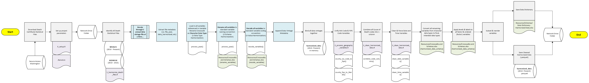

# Overview
WA local health jurisdictions (LHJs) are provided death certificate data by the WA DOH Center for Health Statistics (CHS) in the Secure Access Washington platform. This repository covers the preparation and use of person level microdata which can be used for in-depth population health analyses from 2010 to present.

## Author(s) & Contributor(s)
- [Tyler Bonnell](mailto:Tyler.Bonnell@co.snohomish.wa.us) (Snohomish County Health Department - Informatics & Data Management Epidemiologist)
- [Jacob Armitage](mailto:jacob.armitage@co.thurston.wa.us) (Thurston County Public Health & Social Services Department - Assessment & Evaluation Epidemiologist)
- [Neil Panlasigui](mailto:neilp@co.skagit.wa.us) (Skagit County Public Health - Epidemiologist)
- Danny Colombara (Public Health-Seattle King County)
- Jeremy Whitehurst (Public Health-Seattle King County)

## Motivation
The Washington Department of Health (WA DOH) Center for Health Statistics (CHS) provides annual certificate statistical files from 2010 to present in Secure Access Washington. Files from 2010 to 2015 were sourced from a legacy system known as Bedrock, whereas files from 2016 to present are sourced from the [Washington Health and Life Events System (WHALES)](https://doh.wa.gov/licenses-permits-and-certificates/vital-records/whales) system. Because of this system migration two sets of annual death certificate statistical files (Bedrock 2010-2015; WHALES 2016-2020) have differing data schemas and code-values sets, making it difficult to derive granular insights over extended time periods. 

This repository aims to address this problem, as well as streamline the use of annual death certificate statistical files for population health analyses by harmonizing multiple annual data vintages into a single, multi year data set (referred to as `harmonized_data`).

| **Year(s)** | **Source**                                        | **Notes**                                                                                                                           |
| ----------- | ------------------------------------------------- |  ----------------------------------------------------------------------------------------------------------------------------------- |
| 1980-2015   | BEDROCK                                  | Only 2010 to 2015 data vintages are available in Secure Access Washington                                                                                                                                    |
| 2016+       | [Washington Health and Life Events System (WHALES)](https://doh.wa.gov/licenses-permits-and-certificates/vital-records/whales) | Bedrock to WHALES migration means that BEDROCK (2010-2015) data vintages must have variable names and coded values converted to align with WHALES (2016-Present) schema. |

Currently, the multi-year data set (`harmonized_data`) focuses only on harmonizing multiple years of **finalized** death certificate **statistical** files. This code and workflow could be adapted to incorporate additional types of death certificate files as well as preliminary data if it would be valuable to end users. 

# Workflow
This workflow details how users can leverage the pre-existing code to generate a new `harmonized_data` file for their teams. **Note:** Users will only need to run the code 1 time per data refresh cycle. At the end of this workflow, the multiple year harmonized data set (`harmonized_data`) will be available for use without re-running this code.


## Pre-Requisites
1. Download and store all raw annual WA DOH CHS death certificate files in a single folder location.
- **Note:** Be sure to download the `.csv` version of the files, as this workflow is NOT designed to process `.xlsx` files. It is ok if you download both the `.csv` and `.xlsx` version of the same annual file (as it will only pick up the `.csv` version).


## How to Run the Code

0. Open the `.Renviron` file and specify:
    - `RAW_DEATH_FILES_FOLDER` = Where your team stores WA DOH CHS Death Certificate Statistical Files
    - `HARMONIZED_DEATH_FILE_FOLDER` = Where you want `harmonized_data` to be saved (can be the same as `RAW_DEATH_FILES_FOLDER`.)
2. Run `Scripts/0_setup.R`. This script loads all packages and custom functions, defines workflow parameters, and loads critical crosswalks (`Resources/Crosswalks and Schemas`) and code sets (ex: cemetery, country, facility, fips, and more).
3. Run `Scripts/1_harmonize_death_files.R`. This script loads each data vintage and performs the operations (specified below) before returning the single, multiple year data set: `harmonized_data`.
    - **Data Type Harmonization** (all variables as character data types)
    - **Schema Harmonization** (all variables to standardized naming convention)
    - **Value Harmonization (recodes data vintage variable values to a set of standardized code options)**
4. Run `Scripts/2_process_geography_variables.R` This script unifies the disparate death, residence, and injury county and state code variables used across data vintages (most notable being WA codes vs FIPS codes).
5. Run `Scripts/3_clean_harmonized_data.R`. This script:
    - Cleans all ICD-10 code variables
    - Cleans all date and time variables
    - Ensures all variables are converted to their final, desired data type (such as characters to factors with labels)
    - String variables are set to title case
    - Save`harmonized_data`
  
## Workflow Diagram


## How to Use the Harmonized Data Set
The multiple year harmonized data set (`harmonized_data`) will be saved as a [parquet](https://www.r-bloggers.com/2023/11/folks-cmon-use-parquet/) file. Parquet is a file format that is optimized for working with large data sets (it is fast and has great file size compression) and collaborating across multiple environments. Here's how you can load a parquet file using R:

```R
# install.packages("arrow") # uncomment and install if you do not have the arrow package installed
library(arrow)
harmonized_data <- arrow::read_parquet("INSERT_FOLDER/harmonized_data.parquet")
```

## Updating the Harmonized Data Set
The admins of this repository  will seek to update this repository annual to ensure `harmonized_data` includes the most recently published annual death statistical files released. Instructions to add new data vintages or new variables to `harmonized_data` is available in the `README` excel sheet of `Resources/Crosswalks and Schemas.xlsx`
